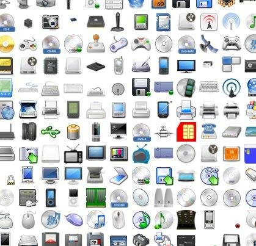

ioBroker.icons-open-icon-library-png
=================

Icon set for ioBroker.vis and ioBroker.mobile from Addictive Flavour Icon Set.
http://sourceforge.net/projects/openiconlibrary/

You can check all icons [here](ICONLIST.md).

### How to use
- install "icons-open-icon-library-png" icon set (as adapter) and navigate in ioBroker.vis in image selector dialog to "/icons-open-icon-library-png/".

## Changelog
### 0.1.0 (2015-05-21)
* (bluefox) initial commit

